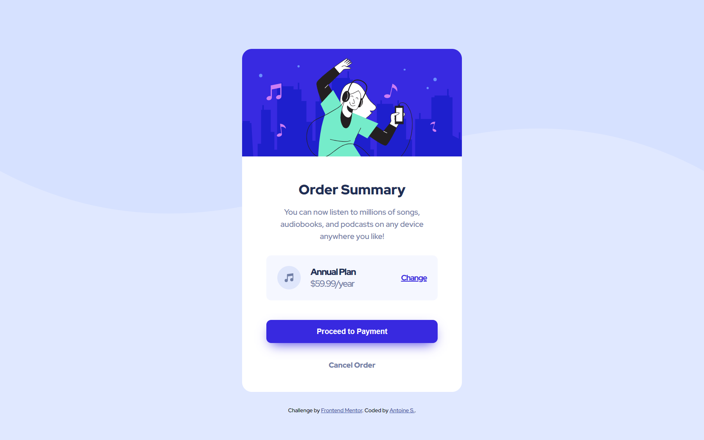

# Frontend Mentor - Order summary card solution

This is a solution to the [Order summary card challenge on Frontend Mentor](https://www.frontendmentor.io/challenges/order-summary-component-QlPmajDUj). Frontend Mentor challenges help you improve your coding skills by building realistic projects. 

## Table of contents

- [Frontend Mentor - Order summary card solution](#frontend-mentor---order-summary-card-solution)
  - [Table of contents](#table-of-contents)
  - [Overview](#overview)
    - [The challenge](#the-challenge)
    - [Screenshot](#screenshot)
    - [Links](#links)
  - [My process](#my-process)
    - [Built with](#built-with)
    - [What I learned](#what-i-learned)
    - [Continued development](#continued-development)
    - [Useful resources](#useful-resources)
  - [Author](#author)


## Overview

### The challenge

Users should be able to:

- See hover states for interactive elements

### Screenshot



### Links

- Solution URL: [Frontend Mentor](#)
- Repository URL: [GitHub](https://github.com/antoines21/frontendmentor/tree/main/order-summary)
- Live Site URL: [GitHub Pages](https://antoines21.github.io/frontendmentor/order-summary/)

## My process

### Built with

- Semantic HTML5 markup
- CSS custom properties
- Flexbox

### What I learned

Use this section to recap over some of your major learnings while working through this project. Writing these out and providing code samples of areas you want to highlight is a great way to reinforce your own knowledge.

To see how you can add code snippets, see below:

```css
.card {
    margin: 100px auto 30px;
    width: 450px;
    background-color: white;
    display: flex;
    flex-direction: column;
    border-radius: 20px;
    overflow: hidden;
    font-family: 'Red Hat Display', sans-serif;
}

.card__content__description {
    font-size: 16px;
    font-weight: 500;
    text-align: center;
    color: var(--desatured-blue);
    margin-top: 0;
    line-height: 25px;
}
```

### Continued development

I will continue to learn the specifics of CSS, especially flexbox. I also learned BEM naming.

### Useful resources

- [BEM Naming](http://getbem.com/naming/) - This site details the main rules for BEM naming (CSS class naming).
- [CSS Overflow](https://developer.mozilla.org/en-US/docs/Web/CSS/overflow) - This site details the CSS overflow rule.

## Author

- Frontend Mentor - [@antoines21](https://www.frontendmentor.io/profile/antoines21)
- GitHub - [@antoines21](https://github.com/antoines21)